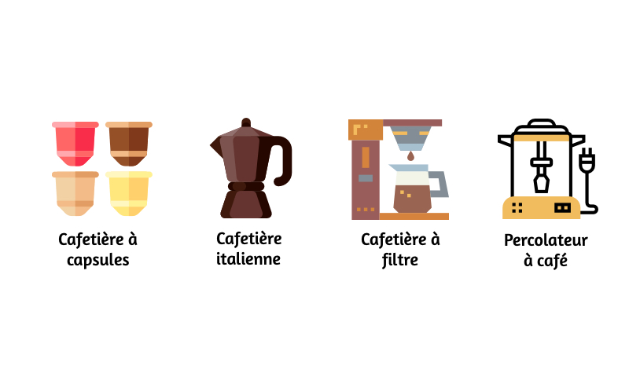
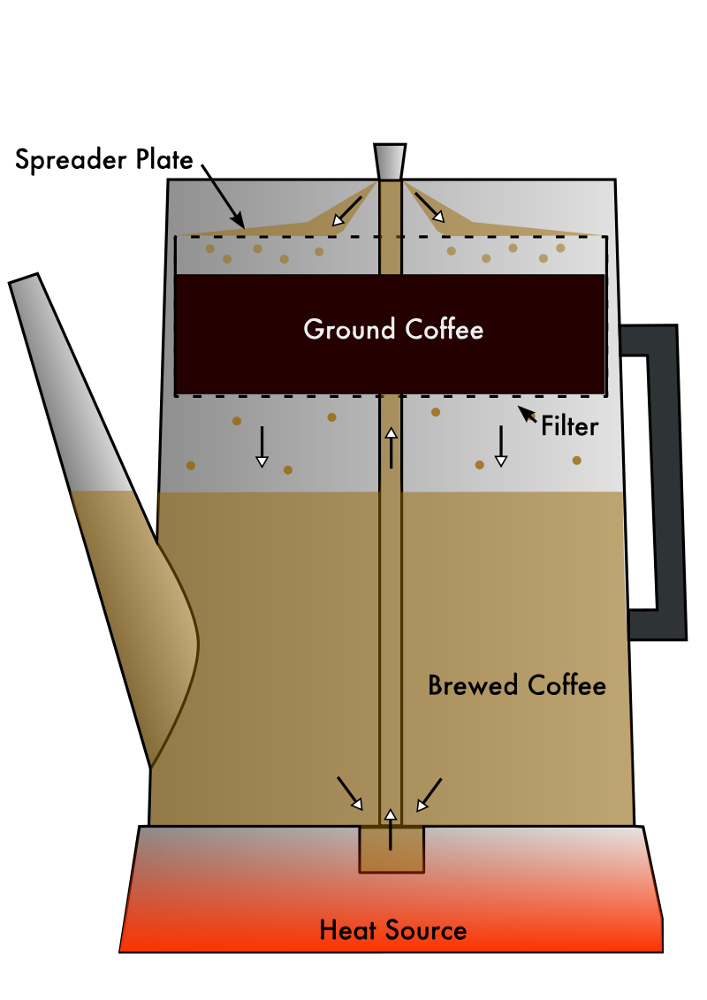

# Introduction

Le café est l’une des boissons les plus consommées dans le monde. Cependant, il existe de nombreux cafés différents les uns des autres, comme le café noir, l’espresso, le cappuccino et des dizaines d’autres encore. Ces cafés sont d’abord différents par le grain de café utilisé mais également et principalement par la machine à café utilisée. En effet il existe plus d’une dizaine de types de machines à cafés différentes. Chaque machine à café possède une méthode d’élaboration propre, et donc un résultat différent. 

 

Nous nous intéressons au percolateur à café. En effet, cette machine à café utilise un phénomène bien répandu, la théorie de la percolation. 

# Le sujet

**Qu'est-ce que la percolation ?** Le mot vient du latin percolatio signifiant « filtration ». Utilisé dans un grand nombre de situations, il évoque les notions de propagation et d'agglutination dans des milieux. On rencontre la percolation le plus souvent dans le passage d'un liquide dans un milieu poreux. La percolation dépend de plusieurs facteurs tels que la porosité, la densité et la capacité du milieu à absorber l'eau.  

Par exemple, lorsqu'on parle de l'infiltration des eaux de pluie dans les nappes phréatiques, on suppose que l'eau s'écoule dans la roche, mais encore faut-il que cette roche soit suffisamment poreuse pour le permettre. La théorie de la percolation permet de déterminer la porosité suffisante pour le permettre. 

Le modèle théorique de la percolation est utilisé dans beaucoup d'autres domaines : la simulation de la propagation des épidémies ou des feux de forêts par exemple. 

Il existe un seuil critique de percolation. Si la probabilité est inférieure à ce seuil, il n'y a jamais percolation et si elle est supérieure à ce seuil, il y a toujours percolation. Le seuil critique théorique de percolation est de 0.592746. 

Le but de notre simulation est alors d’approcher de ce seuil critique de percolation avec le percolateur à café. Ici le fluide est représenté par l'eau chaude et le milieu poreux par la mouture de café. 

 

On s’intéressera ainsi aux conséquences que peuvent porter les différents facteurs tels que la perméabilité de la mouture et de sa densité durant la procédure de percolation sur le rendement du café.

# Le modèle

On a créé aini un programme en Python permettant de modéliser à l'aide d'une fenêtre Tkinter le phénomène de percolation du café. 

Lien vers le programme complet : <a href=""> C'est ici ! </a>

# La simulation
# Analyse critique
# Perspectives et conclusion

## Lien vers la page du blog : <a href="blog.md"> C'est ici ! </a>

## Présentaion de l'équipe

<table>
    <tr>
        <td>KIRITHARAN Pagish</td>
        <td>VAZ Christian</td>
        <td>AUDIN Matthias</td>
        <td>KECHEK Filip</td>
    </tr>
</table>

Nous sommes actuellement en 1ère année de licence à [Sorbonne Université](https://www.sorbonne-universite.fr/) en [MIPI](http://licence.premiereannee.sorbonne-universite.fr/fr/la-licence-1ere-annee/portail-mipi.html).

