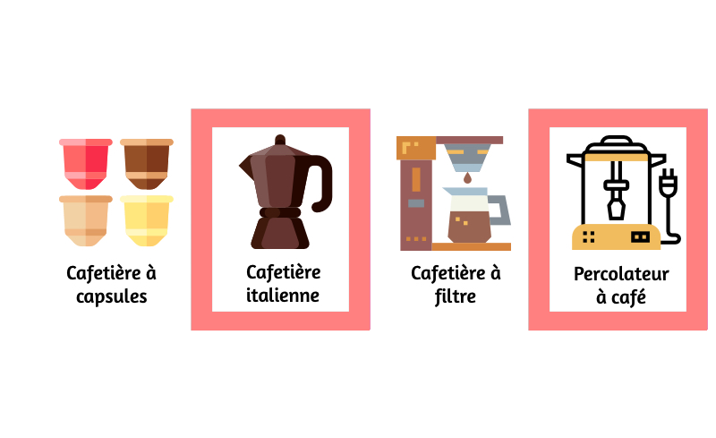
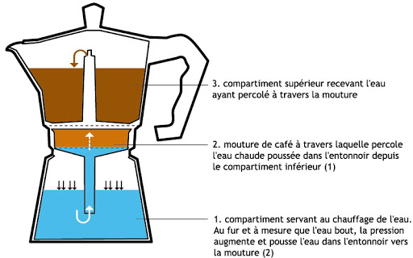
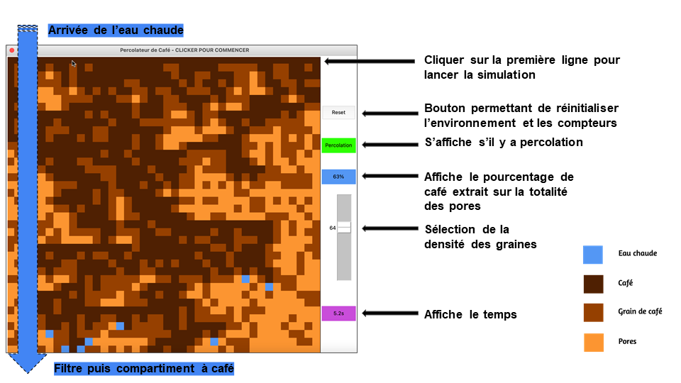

# Introduction

Le café est l’une des boissons les plus consommées dans le monde. Cependant, il existe de nombreux cafés différents les uns des autres, comme le café noir, l’espresso, le cappuccino et des dizaines d’autres encore. Ces cafés sont d’abord différents par le grain de café utilisé mais également et principalement par la machine à café utilisée. En effet il existe plus d’une dizaine de types de machines à cafés différentes. Chaque machine à café possède une méthode d’élaboration propre, et donc un résultat différent. 

  

Nous nous intéressons alors à deux types de cafetière, la cafetière italienne et le percolateur à café. En effet, ces deux machines à café utilisent un phénomène bien répandu pour faire le café, **la théorie de la percolation**. 

# Présentation de l'équipe

<table>
    <tr>
        <td>KIRITHARAN Pagish</td>
        <td>VAZ Christian</td>
        <td>AUDIN Matthias</td>
        <td>KECHEK Filip</td>
    </tr>
</table>

# Le sujet

**Qu'est-ce que la percolation ?** Le mot vient du latin percolatio signifiant « filtration ». Utilisé dans un grand nombre de situations, il évoque les notions de propagation et d'agglutination dans des milieux. On rencontre la percolation le plus souvent dans le passage d'un liquide dans un milieu poreux. La percolation dépend de plusieurs facteurs tels que la porosité, la densité et la capacité du milieu à absorber l'eau.  

Par exemple, lorsqu'on parle de l'infiltration des eaux de pluie dans les nappes phréatiques, on suppose que l'eau s'écoule dans la roche, mais encore faut-il que cette roche soit suffisamment poreuse pour le permettre. La théorie de la percolation permet de déterminer la porosité suffisante pour le permettre. 

Il existe un seuil critique de percolation. Si la probabilité est inférieure à ce seuil, il n'y a jamais percolation et si elle est supérieure à ce seuil, il y a toujours percolation. Le **seuil critique théorique de percolation est de 0.592746**. 

Le modèle théorique de la percolation est utilisé dans beaucoup d'autres domaines : la simulation de la propagation des épidémies ou des feux de forêts par exemple. 

Ci-dessous est représenté un schéma de fonctionnement de la cafetière italienne. La cafetière italienne permet d’obtenir des cafés espresso. Elle se compose de trois parties distinctes: le réservoir d’eau (partie basse de la cafetière), le filtre (où l’on dépose la mouture de café) et pour finir la partie haute de la cafetière où s’écoulera le café. Il suffit donc de remplir le réservoir d’eau, le filtre de café moulu et de mettre la cafetière à chauffer. L’eau va commencer à bouillir, la pression augmente et pousse la vapeur d’eau dans l'entonnoir vers la mouture. La vapeur d'eau percole à travers le café moulu et fini dans le compartiment supérieur sous forme de café. 

  

Le but de notre simulation est alors d’approcher le seuil critique de percolation avec le percolateur à café. Ici, le fluide est représenté par l'eau chaude et le milieu poreux par la mouture de café. On s’intéressera ainsi aux conséquences que peuvent porter les différents facteurs tels que la perméabilité et la densité de la mouture sur le rendement du café.

# Le modèle

On a créé ainsi un programme en Python permettant de modéliser à l'aide d'une fenêtre Tkinter le phénomène de percolation du café. 

Voici à quoi ressemble notre simulation : 

  

 

Lien vers le programme complet : <a href="https://github.com/ARE-dynamic-G2-2021/Percolation-Cafe/blob/gh-pages/perco_tkinter.py"> C'est ici ! </a>

# La simulation

Voici une vidéo contenant plusieurs exemples de percolation :  

<video src="./image/Simulation.mp4" width="640" height="400" controls="" preload=""></video>

Voici une vidéo contenant plusieurs exemples de  non-percolation :

<video src="./image/simulation_pas_percolation.mp4" width="640" height="400" controls="" preload=""></video>

# Analyse critique

Dans le cas de la cafetière à filtre, la dilution de l'eau dans le café prend plus de temps, et donc les arômes sont plus concentrés. 

Dans le cas d'un espresso par exemple, la percolation se fait très rapidement, ne laissant pas la concentration en arôme prendre de l'ampleur. Bien sûr, il est possible d'ajuster cette concentration en utilisant une quantité de mouture plus importante pour une quantité d'eau moindre. 

**Nous avons pris en compte différents facteurs pour notre simulation, chacun modifie la simulation de façon différente** :  

Nous avons pour commencer déterminé la taille des graines de café, en effet plus les graines sont petites plus le café à un arôme plus affiné, au contraire plus les graines sont grandes plus on obtient un arôme plus fade. 

Il y a également le volume de la mouture de café qui entre en jeu, plus la mouture est volumineuse, plus le rendement sera élevé et le café sera plus concentré. Mais lorsqu'elle est moins volumineuse, on obtient un café avec un rendement moindre et un café moins concentré. 

Nous avons aussi pris un facteur théorique qui est la densité des graines de café, quand la densité est élevé la percolation ne se passe pas correctement, elle peut même ne pas être réalisé. Dans le cas contraire la percolation se passera beaucoup plus facilement. 

# Perspectives et conclusion

Dans notre simulation, nous n'avons pas pris en compte les facteurs tel que la température (le goût du café dépend également de la température, c'est ce qu'on appelle la lixiviation) et  la pression ( la pression joue un rôle assez important pour la préparation de certains types de café tel que l'Espresso). Ces deux facteurs sont assez compliqués de représenter dans des simulations comme les notres, on les a alors négligés.  

On dévie aussi de la réalité car nous ajoutons l'eau sur toute la partie haute du café pour pouvoir constater plus facilement l'effet de la percolation dans le café.  

Pour conclure, la percolation est un phénoméne très commun qui est étudié dans plusieurs domaines scientifique. Nous simulation si limite à une représentation en 2D, d'ou les seuils de percolation assez exigeants.
Notre simulation de percolateur de café est très spécifique du a ces certaines limites au niveau des facteurs.
Nous voyons donc que grâce la taille des graines de café, leur volume et leur densité on peut savoir s'il y a percolation et en combien de temps.

## Lien vers la page du blog : <a href="https://are-dynamic-g2-2021.github.io/Percolation-Cafe/blog"> C'est ici ! </a>

Nous sommes actuellement en 1ère année de licence à [Sorbonne Université](https://www.sorbonne-universite.fr/) en [MIPI](http://licence.premiereannee.sorbonne-universite.fr/fr/la-licence-1ere-annee/portail-mipi.html).

